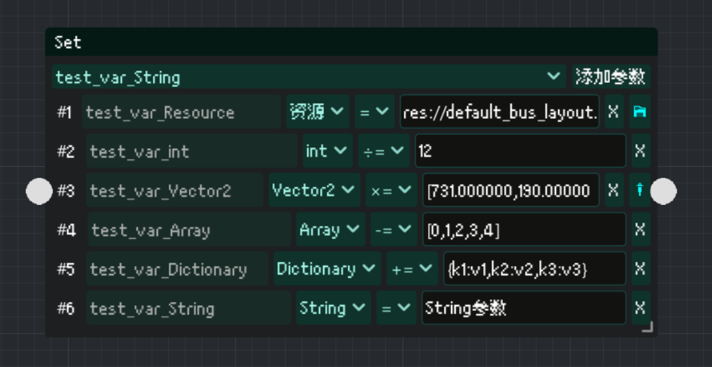
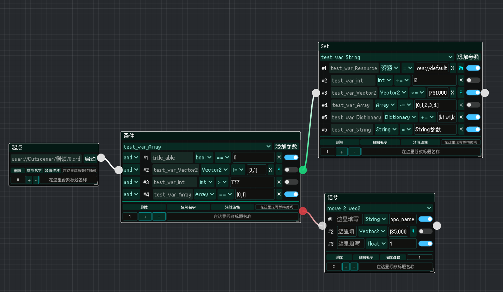

# Cutscener


A visuallize event tree editor.
Easily create a branching event tree in a visuallize way, base on 3 type nodes:
- SignalNode(run method)
- SetNode(set variable)
- ConditionNode(condition branching)

No need to restart debuging while editing, seeing result in realtime.Very suitable to create a cutscene or dialogue system.
Support node combination.

## Install
- Unzip package to `res://addons/`.
- Enable Cutscener in project setting - plugin.
- Reload project.
- Switch to Cutscener editor,click setting.
- Config what autoloads you want to use.
   - Cutscener will read all `methods` in those autoloads you choose under `MethodBus` tab, then can be calling in `SignalNode`
   - Cutscener will read all `properties` in those autoloads you choose under `StateBus` tab, then can be calling in `SetNode` and `ConditionNode
> [!IMPORTANT]
> Only the autoload with `@tool` annotation will shown in the setting,otherwise it can't running in editor.


## Usage
- Create .crd file in Cutscener Editor.
   - Detail in [Node Introduction](https://github.com/CodePlayK/Godot4-Cutscener/blob/master/README-en.md#node-instruction)


- Instantiate CutscenerRunner in your project.


 - Cutscener Data : The `.crd` file you want to run in this runner.
   - If you leave this empty,then this runner will run the `.crd` you last save in Cutscener Editor.
 - Cutscener Name : The cutscener name for `cutscener_run` signal to called,default is "NA".
> Noted : You probably need to restart project after setting for autoload to work.
- Emit `CutscenerGlobal.cutscener_run` signal in any of your script,pass by the Cutscener Name you what to run.
```
CutscenerGlobal.cutscener_run.emit("Cutscener Name")
```
> [!IMPORTANT]
> The same runner can't be shutdown or repeat run while running for now.

- You need to save your `.crd` file under `user://` rather `res://`,in that,your modify of `.crd` will effect during debuging after you save the file.
## Node Instruction
### StartNode
Only serve as a start mark.

### SignalNode
The node you run method in,you can choose the method in all Autoloads you config in setting-Method Bus 
- Choose one method in selection.
- Node will automatic show all args with type hint.
- Write your arg in json string,node automatic convert the type. 

### SetNode
The node you set properties in,you can add multi properties in all Autoloads you config in setting-State Bus 

- Choose property in selection and press `add`.
- Base on property type, you can choose many operat on it,like `+=`,`*=`...
### ConditionNode
Branching node base on condition you add,it will output `TRUE` or `FALSE`.

- Choose property in selection and press `add`.
- Support multi condition type.
- Support `and` & `or`.

### CombineNode
The node that you can create from nodes you selected or just load in.
To create from nodes:
 - Create a new StartNode and connect it to nodes that you want to combine as a startpoint.You only need to connect the start of nodes you choose,no need to connect every node to it.
 - Select more than one node.
    - You can export variable to display on CombineNode by turn on the param export switch in right.
 - Click right mouse button.
 - Select `Combine selected nodes...`.
 - Choose the path you want to put this combine node's save file in.

To load from `.crd`:
 - Select no node.
 - Click right mouse button.
 - Select `Load combine save...`.




Use:
- Modify the export param in CombineNode equal to modify the origin node. 
- You can discombine it.

Limits(for now):
- Must have one StartNode.
- Not support multi level combination,you can't select CombineNode while combining.
- ~~Combine node's save file is same to `.crd`,but you `should not` move this file, or it might cause 
 the CombineNode that linked to it failed.~~
> [!IMPORTANT]
> After update,there is only one complete save file with whole data.Combining nodes will still create a new `.cnd` file as a template,you still can import this file,but it will not be required after imported,you can move it where ever you want or delete it.
- Combine node don't support branching output.

### Menu for all nodes


- waite time : Additional wait time after this node finished.
- index : The order this node running in the save level.
   - All the nodes witch has the same generations to the start node is consider to be in one level no matter if the node in different branch. 
- title edit : Edit custom title name.
- discombine(CombineNode exclusive) : Discombine this CombineNode,the param with be exported will be update.
- show connection data(CombineNode exclusive): Show where this node's export param linked in the combine save file.

### Tips
You can use `{{variable name in StateBus}}` to represent variable:


You can press `ALT+↑/↓` to fast select variable name in the left panel while cursor is in between `{{` and `}}`.


### LICENSE
Licensed under the `MIT` license.
