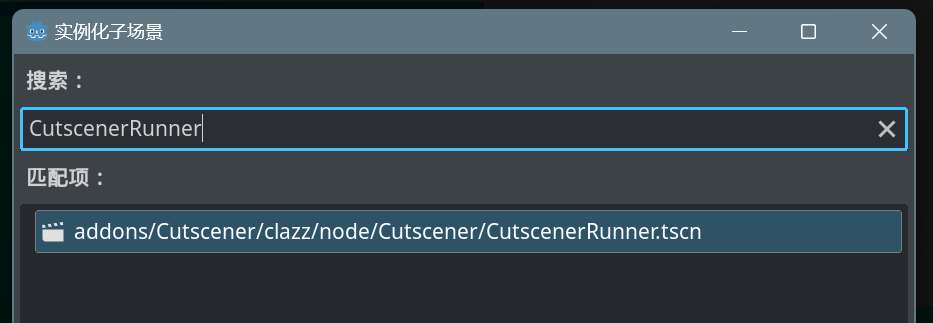

# Cutscener
[in English](https://github.com/CodePlayK/Godot4-Cutscener/blob/master/README-en.md)


一个Godot的可视化事件编辑器,从**Autoload**中读取指定脚本中的所有方法以及变量,以创建可视化`节点`的形式编排运行方法与设置变量的顺序.
推荐用于制作游戏过场行为,也可以辅助用于制作对话.

## 使用
- 压缩包解压到`res://addons/`目录下.
- 启用插件.
- 重新载入整个项目.
- 切换到Cutscener编辑器,点击Setting按钮.
- 配置要加载的Autoload全局单例脚本.
   - Cutscener会读取MethodBus下选中的全局脚本中的`方法`, 可以在信号节点中调用.
   - Cutscener会读取StateBus下选中的全局脚本中的`变量`, 可以在Set与条件节点中调用.
> [!IMPORTANT]
> 注意: 要读取的脚本必须为Autoload全局脚本 ,且需要在顶部添加`@tool`注解,否则无法在编辑器中运行.


- 在Cutscener编辑器中编辑完成后,保存为`.crd`存档文件
   - 详情见[节点介绍](https://github.com/CodePlayK/Godot-Cutscener#节点介绍)

- 在项目中实例化一个CutscenerRunner




  - cutscener_data : 该过场要执行的`.crd`存档文件
    - 为空时则会默认执行编辑器中最新保存过的存档
  - cutscener_name : `过场名`,默认为`"NA"`

- 在Cutscener编辑器界面编辑并保存`.crd`文件
- 在脚本中调用`CutscenerGlobal`中的`cutscener_run`信号,并把要运行的`过场名`作为参数
```
CutscenerGlobal.cutscener_run.emit("过场名")
```
> [!NOTE]
> 目前同一个过场在执行结束前无法重复执行与外部中断
- 当存档文件放在`user://`而不是`res://`时,即使游戏正在debug运行,在保存修改过的过场存档文件(`.crd`)后,依然可以即时看到修改效果,不需要重启游戏debug
## 节点介绍
### StartNode `起点节点`
只起作标记运行起点,也可以点击启动运行


### SignalNode `信号节点`
方法执行节点,自动读取设置中MethodBus下选择的所有Autoload的方法.

- 下拉选择框选择要运行的方法
- 自带参数类型提示,第一列用于自定义该参数提示
- 自动根据一定规则自动将所填的String转换为方法参数所需类型
  

### SetNode `Set节点`
方法执行节点,自动读取设置中StateBus下选择的所有Autoload的变量.


- 下拉框选择变量,点击`添加参数`
- 根据变量类型,支持多种运算赋值:+=,-=...

### ConditionNode `条件节点`
多条目判断节点,根据所添加的判断条件输出`TRUE`或`FALSE`


- 下拉框选择变量,点击`添加参数`
- 支持多种判断条件
- 支持`and`与`or`连接


### CombineNode `聚合节点`
多节点合并为一个聚合节点,可以通过选中一个以上节点后从右键菜单创建,或者在未选中节点时,右键导入.支持将被合并节点中,导出开关打开的参数导出并显示到聚合节点上


创建:
- 添加一个新的起点节点,将想要合并的节点的起点连接上去
- 配置选中节点中参数条目的导出开关,打开表示该条目会被导出并显示在聚合节点上
- 选中新添加的起点节点,和其他1个以上节点,点击右键,选择`合并选中节点...`
- 选择聚合节点的存档位置,保存

使用:
- 修改聚合节点上导出的参数,保存时会修改该参数条目对应的原参数
- 运行时等同于合并前的原节点
- 可以重新分解为原节点

目前限制:
- ~~聚合节点的存档无法移动,移动会导致链接到此文档的所有聚合节点失效.~~
> [!IMPORTANT]
> 目前已改为单一存档文件,新建聚合节点时会创建新的`.cnd`类型的文件,该类文件作为模板依旧可以导入,但数据不会链接上去,可以任意移动和删除,不会影响导入完毕的`.crd`存档文件.
- 仅支持一级聚合,即合并节点中包括聚合节点时,运行可能异常.
- 聚合节点的存档不能移动,可以打开修改,但`删除`其中导出过参数的节点,可能会导致链接到自身的聚合节点不可用.
- 输出不支持分支.

### 通用菜单


- 配置等待时间 : `await`方法运行结束后的等待时间,即该节点执行结束后的等待时间
- 配置该节点在同层级节点中的运行顺序 : 所有到`起点节点`相隔节点数相同的节点都会视为同一层级的节点,无论是否在不同的分支上
- 修改标题名 : 自定义节点名
- 分解(聚合节点独有) : 将聚合节点解散为原节点,导出的数据以聚合节点为准
- 显示连接数据(聚合节点独有) : 显示导出的参数在链接的存档文件中的位置
  
### Tips
你可以在文本编辑框中使用`{{StateBus包含的变量名}}`来指替对应变量值:


当光标位于`{{`与`}}`之间时,可以按`ALT+↑/↓`,在左侧显示的可调用的全局变量中快速选择.


### LICENSE
Licensed under the `MIT` license.
